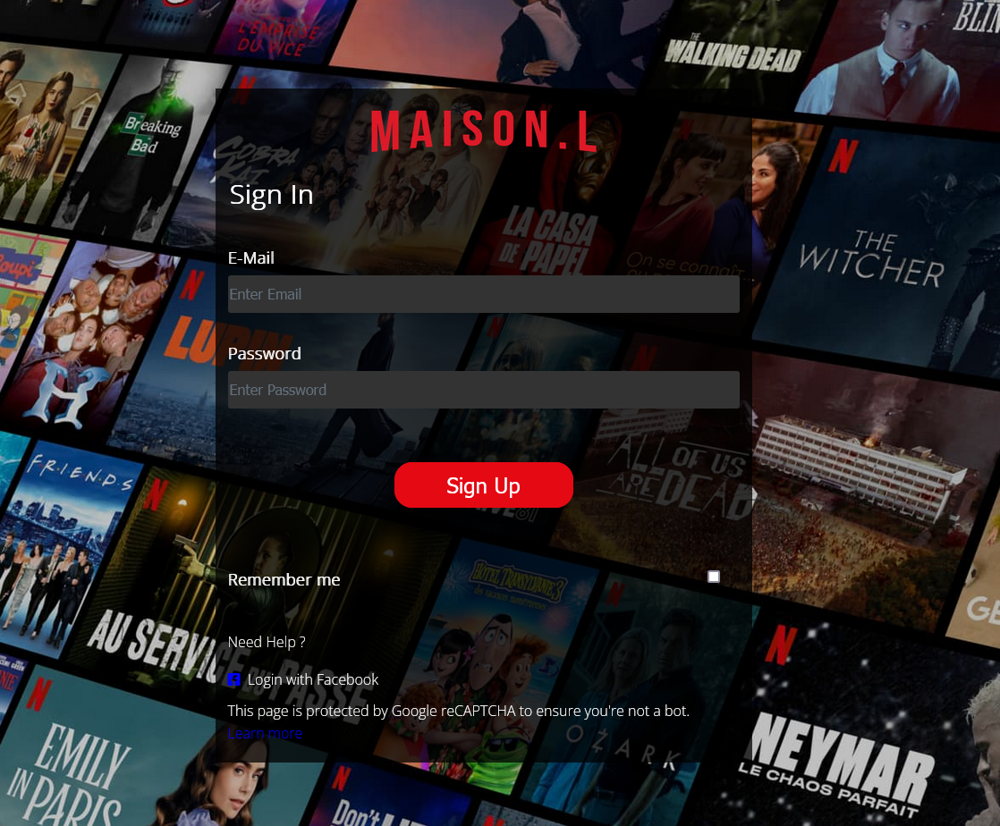

# Projet AP WEB    | Bachelor IRIS |   `NETFLIX`

## Tabai LAHMAR

[Voir le lien du site](https://lahmartabai.github.io/Copie_Netflix/)

## Sommaire :

1. [Introduction](#Introduction)

2. [Fonctionnement](#Fonctionnement)

3. [Annexe_Développeur](#Annexe_Développeur)

# `Introduction`

Une agence nous confie la réalisation d’une copie de NETFLIX sur le web. La promotion a pour but de conquérir des nouveaux abonné(e)s, en proposant la diffusion de toutes sortes des films et des séries. Pour cela nous conseille d’abord d’analyser toutes les fonctionnalités au travers des deux wireframes. Les spécifications pour le fonctionnement de chaque partie ne sont pas définies. La charte graphique doit être crée par vous.

Pour commencer vous devez tout simplement mettre en place une structure html sémantique car le contenu de cette plateforme est destiné à tout public. 

 

# `Fonctionnement`

Le site web présenté ici a pour fonctionnalité globale la possibilité de s’inscrire et de garder la session enregistrée sur une base de données afin de pouvoir se connecter. Il est aussi possible, une fois connecté, de visualiser et de choisir des films ou des séries à regarder présenté sur la page, cette inscription sera enregistrée et visible par le client, l’information sera aussi stockée sur la base de données. Cette interface sera décrite ici sous forme de manuel d'utilisation de la page.

## Documentation utilisateur :

# Accueil

 

En premier lieu, sur la page d’accueil du site, vous aurez accès à la possibilité de vous connecter ou de vous inscrire, soit en cliquant sur “Cliquez ici pour commencer” au bas de la page ou en cliquant sur "Connexion"

## Le modale

# Inscription

# Connexion

# `Annexe_Développeur`

    

    Client (id_client, nom_client, prenom_client, age_client, email_client, password_client, ville_client)
    Consulter (#id_client, #id_event, #date_consultation)
    Historique_Client (date_consultation)
    Films (id_event, nom_event, description_event, date_creation, date_modification, image_event)

Voir la Page Web *[Page web](https://lahmartabai.github.io/Copie_Netflix/)*.